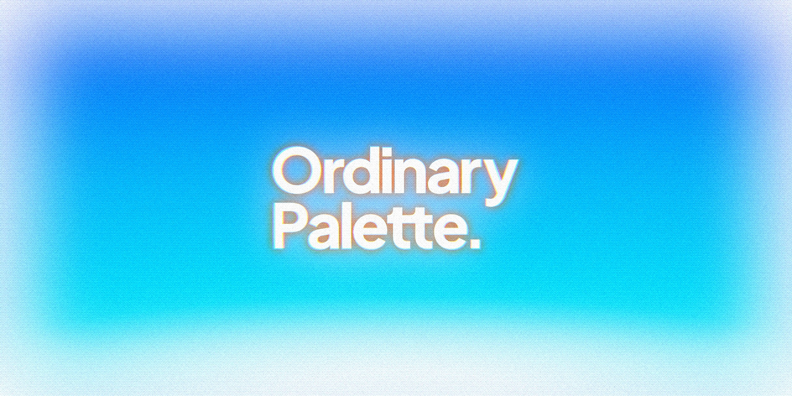

<div align="center">



**The most ordinary, perfect palette you can use anywhere**

Every color keeps the same lightness at each step, so it's easy to build UI with

[](LICENSE)

[한국어](README.md) | English

</div>

## Features

- **Same lightness across colors and steps:** The chromatic families share one lightness curve, so blue 500 and green 500 look equally bright. 13 families × 10 steps (50–900), in light and dark scales.
- **Each step has a job:** 50–200 are backgrounds. 600 is text on white and a fill for white text. White text on 700 and 800 text on 100 reach 4.5:1 or more (for yellow, 900 is the text step).
- **Dark keeps the same jobs:** The dark scale runs the other way, so a step does the same work in both modes. It does not reuse light hex values.
- **Rules locked in by tests:** `npm test` checks lightness spacing, chroma, and contrast on every run.
- **Raw palette only:** There are no semantic roles such as primary, surface, or text. Put your own design system on top.

## Install

```bash
npm install ordinary-palette
```

## Usage

### JavaScript

```ts
import { blue, colors, darkBlue, whiteOpacity } from "ordinary-palette";

colors.blue[500];
colors["light-blue"][500];
darkBlue[500];
whiteOpacity["40"];
```

Each light family is also exported by name: `pink`, `red`, `orange`, `yellow`, `lightGreen`, `green`, `cyan`, `lightBlue`, `blue`, `purple`, `brown`, `coolGray`, `neutralGray`. Dark families are `darkPink`, `darkRed`, `darkOrange`, `darkYellow`, `darkLightGreen`, `darkGreen`, `darkCyan`, `darkLightBlue`, `darkBlue`, `darkPurple`, `darkBrown`, `darkCoolGray`, `darkNeutralGray`, and all of them together are `darkColors`. The opacity scales are `whiteOpacity` and `blackOpacity`.

### CSS

```css
@import "ordinary-palette/colors.css";

.notice {
  background: var(--color-blue-600);
  color: var(--color-white-opacity-100);
}

.notice-dark {
  background: var(--color-dark-blue-500);
  color: var(--color-dark-cool-gray-50);
}
```

CSS variables are named `--color-<family>-<step>` for light and `--color-dark-<family>-<step>` for dark, for example `--color-cool-gray-500`, `--color-dark-cool-gray-500`, `--color-light-blue-500`, `--color-white-opacity-40`, and `--color-black-opacity-05`.

### JSON

```ts
import palette from "ordinary-palette/colors.json" with { type: "json" };

palette.cyan["500"];
palette.dark.blue["500"];
```

## At a glance


## How the curves behave

- **Lightness:** 50 is the lightest and 900 the darkest. Every chromatic family except yellow sits within about 1 L of blue at each step (orange runs up to 3 L lighter), so the same step looks equally bright across families. From 200 to 900, each step is a similar visual change, with a slightly larger drop before 500. 50–200 are background tints, so they sit closer together on purpose.
- **Chroma:** Low at 50, highest at 400–600, and it does not collapse at 900, so dark steps keep their family color. 600 is never more saturated than 500, so 500 reads as the main step.
- **Light tints:** 50–200 share lightness and chroma across chromatic families, so a row of different 100s looks even. Yellow shares 50 only and is brighter from 100 on.
- **Grays:** Start lighter (L 98) with three steps above L 93 for surfaces and borders. cool-gray 900 is the dark body text color. neutral-gray has cool-gray's lightness with zero chroma.
- **Dark scale:** Dark 50 is a dark tinted background, dark 500 is close to light 500 in lightness, and dark 900 is a light tint for text.
- **Visual correction:** Lightness stays on the shared curve. Where colors still look off (for example, saturated blue and purple look brighter), only chroma and hue are adjusted, so contrast does not change.
- **White and black:** Available as opacity scales (`white-opacity`, `black-opacity`) with steps 00, 05, 10, 20, 30, 40, 50, 60, 70, 80, 90, 100.


## Families

| Family | 50 → 900 | Character |
| --- | --- | --- |
| pink |  | A true pink (hue 356), kept apart from red. |
| red |  | A little redder than orange so the two stay apart. |
| orange |  | A vivid orange at 500. Light steps lean apricot, dark steps lean red. |
| yellow |  | Brighter than the shared curve from 100 on. 900 is a deep gold that works as text. |
| light-green |  | Yellow-green between yellow and green. Dark steps lean green so they do not look olive. |
| green |  | A clear green. |
| cyan |  | From aqua to teal. Dark steps are less saturated because of the sRGB limit. |
| light-blue |  | Sky blue between cyan and blue. |
| blue |  | The reference family for the shared lightness curve. |
| purple |  | Slightly more violet than indigo. |
| brown |  | A low-chroma warm brown between orange and gray. |
| cool-gray |  | A slightly cool gray for surfaces, borders, and text. |
| neutral-gray |  | cool-gray's lightness with zero chroma. |

Every family has the steps 50, 100, 200, 300, 400, 500, 600, 700, 800, 900 in both light and dark.

## Step guide

The palette has no semantic roles, and it will not add them. These are measured starting points, not rules (WCAG 2 contrast: 4.5:1 for text, 3:1 for icons and input borders).

- **Grays (light):** 50 and 100 for page and card backgrounds, 200 for dividers, 300 for visible borders, 500 for input borders, 600 for secondary text, 800–900 for body text.
- **Grays (dark):** Dark 50–200 for backgrounds, dark 500 for input borders, dark 600 for secondary text, dark 800–900 for body text.
- **Chromatic families (light):** 600 for text on white and as a fill for white text, 700 for badge text on a 100 tint, 500 for icons on white. For yellow, use 900 for text and 800 for icons.
- **Chromatic families (dark):** Dark 500 for text on dark backgrounds.
- **Same step, similar colors:** Because families share lightness, some same-step pairs are hard to tell apart with color vision deficiency. Add a label or icon, or mix steps.

The full guide, with measured contrast tables, color vision simulation, and screen examples, is in the [Korean README](README.md#스텝-사용-가이드).

## Development

```bash
npm install
npm test
npm run preview
```

`npm test` builds the package and then checks the palette rules: step format, lightness, spacing, chroma, family hue, contrast, the dark scale, visual correction, and whether the README tables and images match the palette.

## License

MIT
