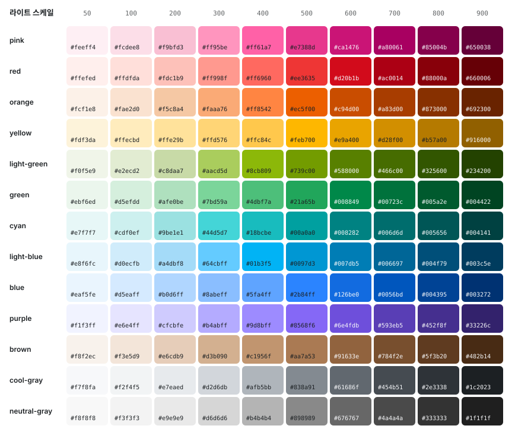
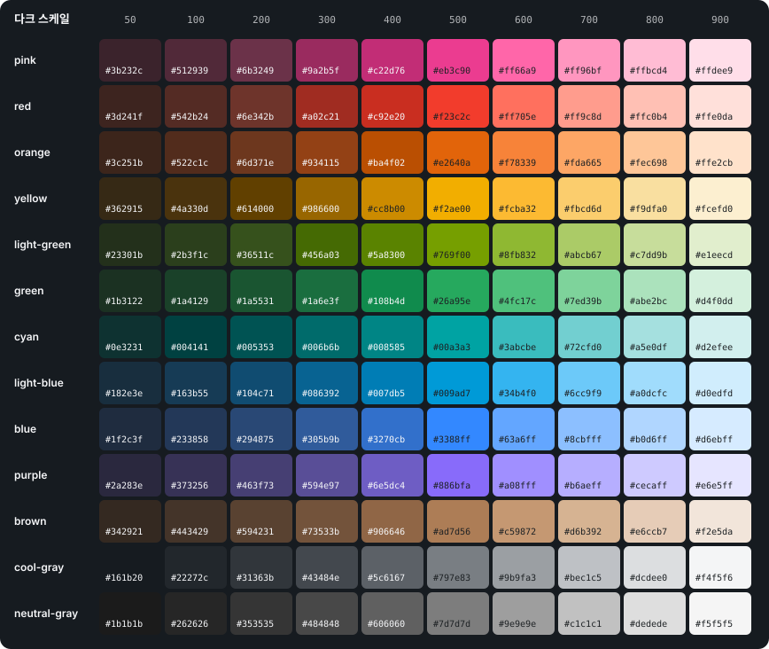
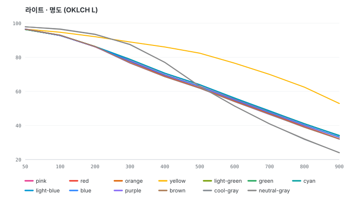
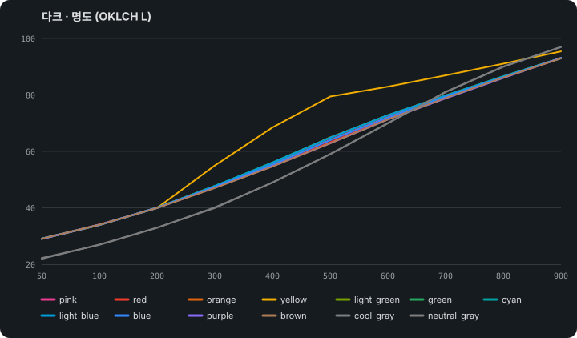
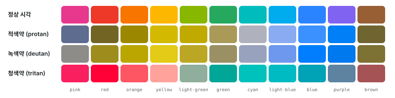

# Ordinary Palette

평범한 인터페이스 작업(배경, 글자, 테두리)을 위한 자연스러운 색 팔레트입니다. 13개 가족이 50부터 900까지 10단계로 이어집니다. 색 값만 제공하는 원시 팔레트이고, primary·surface·text 같은 의미 역할(토큰)은 없습니다.

## 한눈에 보기





## 곡선의 성격

- **명도:** 50이 가장 밝고 900이 가장 어둡습니다. yellow와 회색을 뺀 유색 가족은 명도 곡선 하나를 같이 씁니다. 모든 스텝이 blue에서 약 1 L 안에 있어서(orange만 +3 L), 가족이 달라도 같은 스텝이면 같은 밝기로 보입니다(Toss TDS 2025 개편과 같은 방식). 200부터 900까지는 스텝 하나가 비슷한 크기의 변화(ΔE OK 0.07–0.10)로 보이도록 간격을 맞췄고, 500 전의 하락이 조금 더 큽니다. 700–900도 한 가족 안에서 뚜렷하게 구분됩니다. 50–200은 배경용이라 일부러 촘촘합니다.
- **채도:** 50에서 낮고 400–600에서 가장 높으며, 900까지 크게 무너지지 않아서 짙은 스텝도 가족 색이 남습니다. 600은 500보다 채도가 높지 않아서 500이 메인 스텝으로 읽힙니다.
- **쨍함:** blue·red·orange는 SEED, Toss TDS, Montage의 같은 hue 최저 채도 이상입니다. 나머지 가족도 sRGB가 허락하는 만큼 선명하게 둡니다.
- **옅은 스텝:** 유색 가족은 50–200의 명도와 채도가 같아서(라이트 채도 0.017, 0.036, 0.070), 여러 가족의 100을 나란히 써도 한 가족만 진해 보이지 않습니다. brown은 원래 채도가 낮아 더 옅습니다. yellow만 50을 공유하고 100부터 더 밝게 두어, Toss 수준 채도를 sRGB 안에 넣습니다.
- **회색:** 더 밝은 L 98에서 시작하고, 표면과 테두리용으로 L 93 이상 스텝을 3개 둡니다. cool-gray 900은 어두운 본문 글자색입니다. neutral-gray는 cool-gray와 같은 명도에 채도 0입니다.
- **yellow:** 400부터 blue보다 밝고, 900은 짙은 금색이라 흰 배경과 yellow 100 위에서 글자로 읽힙니다. hue는 50에서 15° 안입니다.
- **다크 스케일:** 방향이 반대입니다. 다크 50은 어두운 틴트 배경, 다크 500은 라이트 500과 비슷한 명도, 다크 900은 글자용 밝은 틴트라서 한 스텝이 두 모드에서 같은 역할을 합니다. 라이트 hex를 재사용하지 않습니다.
- **시각 보정:** 명도가 같아도 채도가 높은 blue·purple은 더 밝아 보입니다(Helmholtz–Kohlrausch 효과). 그래서 purple 700–900은 blue와 같은 비율로 채도를 줄이고, 다크 blue·purple 300–400도 채도를 조금 낮췄습니다. 짙은 light-green은 올리브처럼 보여서 600–900을 초록 쪽으로 2–3° 옮겼습니다. 명도는 그대로라 대비는 바뀌지 않습니다.
- **흰색과 검정:** 투명도 스케일(white-opacity, black-opacity)로 제공합니다.

### 명도 곡선

가로축은 스텝, 세로축은 OKLCH 명도(L)입니다. 선 색은 각 가족의 500입니다.





- **라이트 명도:** 유색 가족은 끝까지 거의 한 줄로 겹쳐서 내려갑니다. yellow는 100부터 따로 밝게 가고, 회색은 더 밝게 시작해서 더 어둡게 끝납니다.
- **다크 명도:** 방향이 반대라서 50(어두운 배경)에서 900(밝은 틴트)으로 올라갑니다.

## 설치

```bash
npm install ordinary-palette
```

## JavaScript

```ts
import { blue, colors, darkBlue, whiteOpacity } from "ordinary-palette";

colors.blue[500];
colors["light-blue"][500];
darkBlue[500];
whiteOpacity["40"];
```

라이트 가족은 각각 이름으로도 export됩니다: `pink`, `red`, `orange`, `yellow`, `lightGreen`, `green`, `cyan`, `lightBlue`, `blue`, `purple`, `brown`, `coolGray`, `neutralGray`. 다크 가족은 `darkPink`, `darkRed`, `darkOrange`, `darkYellow`, `darkLightGreen`, `darkGreen`, `darkCyan`, `darkLightBlue`, `darkBlue`, `darkPurple`, `darkBrown`, `darkCoolGray`, `darkNeutralGray`로 export되고, 한데 모은 `darkColors`도 있습니다. 투명도 스케일은 `whiteOpacity`, `blackOpacity`입니다. `yellowLightnessOffset`과 `darkLightness`는 아래에 적은 명도 숫자를 export합니다.

## CSS

```css
@import "ordinary-palette/colors.css";

.notice {
  background: var(--color-blue-600);
  color: var(--color-white-opacity-100);
}

.notice-dark {
  background: var(--color-dark-blue-500);
  color: var(--color-dark-cool-gray-50);
}
```

CSS 변수 이름은 라이트가 `--color-<가족>-<스텝>`, 다크가 `--color-dark-<가족>-<스텝>`입니다. 예를 들어 `--color-cool-gray-500`, `--color-neutral-gray-500`, `--color-dark-cool-gray-500`, `--color-light-blue-500`, `--color-white-opacity-40`, `--color-black-opacity-05`가 있습니다.

## JSON

```ts
import palette from "ordinary-palette/colors.json" with { type: "json" };

palette.cyan["500"];
palette.dark.blue["500"];
```

## 가족

| 가족 | 50 → 900 | 라이트 500 | 다크 500 |
| --- | --- | --- | --- |
| pink |  | `#e7388d` | `#eb3c90` |
| red |  | `#ee3828` | `#f23c2c` |
| orange |  | `#ee5d00` | `#f2600a` |
| yellow |  | `#feb700` | `#f2ae00` |
| light-green |  | `#739c00` | `#769f00` |
| green |  | `#21a65b` | `#26a95e` |
| cyan |  | `#00a0a0` | `#00a3a3` |
| light-blue |  | `#0097d3` | `#009ad7` |
| blue |  | `#2b84ff` | `#3388ff` |
| purple |  | `#8568f6` | `#886bfa` |
| brown |  | `#aa7a53` | `#ad7d56` |
| cool-gray |  | `#838a91` | `#797e83` |
| neutral-gray |  | `#898989` | `#7d7d7d` |

모든 가족의 스텝은 라이트·다크 모두 50, 100, 200, 300, 400, 500, 600, 700, 800, 900입니다.

- **orange:** 500은 채도 0.19의 쨍한 주황(hue 44)으로, 당근 SEED carrot에 가까운 채도입니다. 주황은 노랑처럼 밝아야 쨍해지는 색이라 300부터 공유 곡선보다 조금 밝게(300은 +1.5 L, 400부터 +3 L) 두고, 짙어질수록 hue를 붉은 쪽으로 옮깁니다. red는 그만큼 3° 더 붉게 두어 정상 시각에서 두 색이 ΔE 0.07 이상 떨어집니다. 옅은 스텝은 살구색(hue 60) 쪽입니다.
- **yellow:** 500·600에서 Toss TDS 채도 이상입니다. 50은 blue와 명도가 같고, 100부터는 blue보다 이만큼(OKLCH L) 밝습니다: 100 +1.9, 200 +5.8, 300 +10.0, 400 +14.7, 500 +19.5, 600 +21.6, 700 +22.4, 800 +22.4, 900 +19.8.
- **light-green:** yellow와 green 사이의 연두(hue 124–133)입니다. 짙은 스텝이 올리브로 보이지 않게 600부터 초록 쪽으로 조금 기웁니다.
- **cyan:** hue 195로 #00ffff 같은 아쿠아에서 #008080 같은 teal로 이어집니다. 이 hue는 밝아야 채도가 나와서, 명도를 맞춘 짙은 스텝은 다른 가족보다 채도가 낮습니다(sRGB 한계).
- **light-blue:** cyan과 blue 사이의 하늘색(hue 232–242)입니다.
- **pink:** hue 356의 진짜 분홍이라 red와 구분됩니다.
- **purple:** hue 288로 indigo보다 살짝 보라 쪽입니다.
- **brown:** orange와 회색 사이의 채도 낮은 따뜻한 갈색(hue 56–64)입니다. 명도가 orange와 같아서, 채도를 더 낮추고 hue를 노란 쪽으로 옮겨 구분합니다.
- **neutral-gray:** cool-gray와 같은 명도에 채도 0입니다. `#666666`은 그 성격을 설명하는 예시일 뿐, 스케일의 스텝이 아닙니다.

다크 cool-gray 명도는 올라가는 순서입니다: 50 = 22, 100 = 27, 200 = 33, 300 = 40, 400 = 49, 500 = 59, 600 = 70, 700 = 81, 800 = 90, 900 = 97. 다크 유색 가족의 50–200은 L 29, 34, 40을 공유합니다. 다크 500은 라이트 500과 명도 4 이내이고, 다크 900은 L 93 근처의 밝은 틴트입니다. 다크 채도는 500에서 가장 높고, 라이트 최고 채도의 90% 이상입니다.

투명도 스텝은 `white-opacity`와 `black-opacity` 모두 00, 05, 10, 20, 30, 40, 50, 60, 70, 80, 90, 100입니다.

## 스텝 사용 가이드

이 팔레트에는 primary, surface 같은 의미 역할(토큰)이 없고, 앞으로도 만들지 않습니다. 아래 내용은 규칙이 아니라 실제로 측정해 본 출발점입니다. 숫자는 WCAG 2 대비입니다. 글자는 4.5:1, 아이콘과 입력창 테두리는 3:1이 기준입니다.

### 회색

**라이트:** 페이지·카드 배경은 50과 100, 구분선은 200, 눈에 보이는 테두리는 300입니다. 입력창처럼 반드시 보여야 하는 테두리는 500(3.5:1), 보조 글자는 600(5.7:1), 본문은 800–900입니다.

**다크:** 배경은 다크 50–200, 입력창 테두리는 다크 500(4.2:1), 보조 글자는 다크 600(6.5:1), 본문은 다크 800–900입니다.

### 유색 가족

각 칸은 기준을 처음 통과하는 스텝입니다. "500 채움색에 맞는 글자"는 500 위에서 더 잘 읽히는 글자색과 그 대비입니다. 어두운 글자는 cool-gray 900이고, 다크 스케일에서는 다크 cool-gray 50입니다.

| 가족 | 흰 배경 위 글자 | 흰 글자를 올리는 채움색 | 500 채움색에 맞는 글자 | 100 틴트 위 뱃지 글자 | 흰 배경 위 아이콘 |
| --- | --- | --- | --- | --- | --- |
| pink | 600 | 600 | 어두운 글자 4.2:1 | 700 | 500 |
| red | 600 | 600 | 어두운 글자 4.1:1 | 700 | 500 |
| orange | 600 | 600 | 어두운 글자 4.8:1 | 700 | 500 |
| yellow | 900 | 900 | 어두운 글자 9.4:1 | 900 | 800 |
| light-green | 700 | 700 | 어두운 글자 5.1:1 | 700 | 500 |
| green | 700 | 700 | 어두운 글자 5.2:1 | 700 | 500 |
| cyan | 700 | 700 | 어두운 글자 5.1:1 | 700 | 500 |
| light-blue | 600 | 600 | 어두운 글자 5.0:1 | 700 | 500 |
| blue | 600 | 600 | 어두운 글자 4.6:1 | 700 | 500 |
| purple | 600 | 600 | 어두운 글자 4.1:1 | 700 | 500 |
| brown | 600 | 600 | 어두운 글자 4.4:1 | 700 | 500 |

다크 스케일 (다크 cool-gray 50 배경):

| 가족 | 다크 50 위 글자 | 500 채움색에 맞는 글자 | 다크 100 틴트 위 뱃지 글자 |
| --- | --- | --- | --- |
| pink | 500 | 어두운 글자 4.6:1 | 700 |
| red | 600 | 어두운 글자 4.5:1 | 700 |
| orange | 500 | 어두운 글자 5.3:1 | 600 |
| yellow | 400 | 어두운 글자 8.9:1 | 500 |
| light-green | 500 | 어두운 글자 5.6:1 | 600 |
| green | 500 | 어두운 글자 5.7:1 | 600 |
| cyan | 500 | 어두운 글자 5.6:1 | 600 |
| light-blue | 500 | 어두운 글자 5.4:1 | 600 |
| blue | 500 | 어두운 글자 5.0:1 | 600 |
| purple | 500 | 어두운 글자 4.6:1 | 700 |
| brown | 500 | 어두운 글자 4.8:1 | 600 |

### 쓸 때 알아둘 점

**1. 밝은 가족의 500 채움색에는 어두운 글자를 올립니다.** 어두운 글자는 cool-gray 900입니다.

| 채움색 | 어두운 글자 | 흰 글자 |
| --- | --- | --- |
| orange 500 `#ec5f00` | ✅ 어두운 글자 4.8:1 | ❌ 흰 글자 3.4:1 |
| yellow 500 `#feb700` | ✅ 어두운 글자 9.4:1 | ❌ 흰 글자 1.8:1 |
| light-green 500 `#739c00` | ✅ 어두운 글자 5.1:1 | ❌ 흰 글자 3.2:1 |
| cyan 500 `#00a0a0` | ✅ 어두운 글자 5.1:1 | ❌ 흰 글자 3.2:1 |
| light-blue 500 `#0097d3` | ✅ 어두운 글자 5.0:1 | ❌ 흰 글자 3.3:1 |

**2. pink·red·purple의 흰 글자 버튼은 600부터 씁니다.** 500은 크고 굵은 글자(3:1)에만 씁니다.

| 가족 | 500 | 600 |
| --- | --- | --- |
| pink | ⚠️ 500 `#e7388d` + 흰 글자 3.9:1 | ✅ 600 `#ca1476` + 흰 글자 5.4:1 |
| red | ⚠️ 500 `#ee3635` + 흰 글자 4.0:1 | ✅ 600 `#d20b1b` + 흰 글자 5.5:1 |
| purple | ⚠️ 500 `#8568f6` + 흰 글자 4.0:1 | ✅ 600 `#6e4fdb` + 흰 글자 5.5:1 |

**3. 흰 배경 위 단독 아이콘은 600 이상을 씁니다.** 아이콘은 3:1이 기준입니다.

| 가족 | 500 아이콘 | 600 아이콘 |
| --- | --- | --- |
| orange | ❌ 500 3.4:1 | ✅ 600 4.6:1 |
| light-green | ❌ 500 3.2:1 | ✅ 600 4.4:1 |
| cyan | ❌ 500 3.2:1 | ✅ 600 4.4:1 |
| light-blue | ❌ 500 3.3:1 | ✅ 600 4.6:1 |

**4. yellow를 글자로 쓸 때는 900만 씁니다.**

| 글자 | 흰 배경 위 | yellow 100 위 |
| --- | --- | --- |
| yellow 500 `#feb700` | ❌ 1.8:1 | ❌ 1.5:1 |
| yellow 700 `#d28f00` | ❌ 2.7:1 | ❌ 2.3:1 |
| yellow 800 `#b57a00` | ❌ 3.7:1 | ❌ 3.1:1 |
| yellow 900 `#916000` | ✅ 5.4:1 | ✅ 4.6:1 |

**5. 50·100 틴트만으로 카테고리를 구분하지 않습니다.** 옅은 틴트는 가족끼리 거의 같아 보입니다(ΔE 0.03 미만). 틴트 위에 700–800 글자나 아이콘을 함께 올립니다.

| 가족 | 틴트 | 채움색 |
| --- | --- | --- |
| pink/red | 100끼리 ΔE 0.020 | 500끼리 ΔE 0.116 |
| light-blue/blue | 100끼리 ΔE 0.011 | 500끼리 ΔE 0.091 |
| cyan/light-blue | 100끼리 ΔE 0.023 | 500끼리 ΔE 0.090 |

**6. hover와 pressed 상태는 라이트에서 한 단계 어둡게(600 → 700), 다크에서 한 단계 밝게 씁니다.**

### 색각 이상 시뮬레이션

적색약·녹색약·청색약을 Machado(2009) 모델로 시뮬레이션해서, 500끼리 거의 같아 보이는 조합을 찾았습니다. 정상 시각에서 이웃 가족끼리는 모두 ΔE 0.10 이상 떨어집니다.



| 시뮬레이션 | 500에서 헷갈리는 조합 (ΔE OK 0.07 미만) |
| --- | --- |
| 정상 시각 | 없음 |
| 적색약 (protan) | orange/brown 0.057, light-green/green 0.052, blue/purple 0.046 |
| 녹색약 (deutan) | pink/green 0.058, pink/cyan 0.041, red/orange 0.043, red/light-green 0.011, red/green 0.052, red/brown 0.044, orange/light-green 0.034, light-green/green 0.063, light-green/brown 0.055, green/brown 0.018, blue/purple 0.015 |
| 청색약 (tritan) | pink/red 0.041, pink/orange 0.038, red/orange 0.036, green/cyan 0.017, green/light-blue 0.035, green/blue 0.053, cyan/light-blue 0.018, cyan/blue 0.038, light-blue/blue 0.023 |

차트처럼 색만으로 구분해야 할 때 쓰기 좋은 500 순서: blue → orange → yellow → brown → cyan → pink. 앞에서부터 고르면 정상 시각과 세 가지 시뮬레이션 모두에서 서로 떨어진 최소 거리가 4색 ΔE 0.057, 5색 0.038, 6색 0.038입니다. 0.07보다 작아지는 개수부터는 색 외에 모양이나 라벨을 함께 씁니다.

- **성공과 오류를 red와 green만으로 구분하지 않습니다.** 녹색약(남성의 약 5%)에게는 red 500과 green 500이 거의 같아 보입니다. 아이콘(✓, !)이나 문구를 함께 씁니다.
- 적색약에게는 red와 brown, 녹색약에게는 blue와 purple, 청색약에게는 cyan과 light-blue가 거의 같아 보입니다. 이 쌍을 나란히 쓸 때는 명도를 두 단계 이상 벌리거나(예: red 500과 brown 800) 라벨을 붙입니다.
- 유색 가족은 명도 곡선을 공유해서, 같은 스텝끼리는 명도 차이가 거의 없습니다. 색각 이상이 있으면 hue 차이만 남기 때문에 헷갈리는 조합이 많아집니다. 같은 스텝의 색을 여러 개 나란히 쓸 때는 스텝을 섞어 명도 차이를 만들거나 라벨을 붙입니다.

### 실제 화면 적용 예시

카드, 폼, 알림이 있는 흔한 화면에 스텝을 대입해 본 예시입니다. 토큰이 아니라 "이 요소에는 이 스텝이 맞았다"는 기록입니다. 괄호 안은 카드 배경(라이트 cool-gray 50, 다크 cool-gray 100)과의 대비이고, 뱃지와 배너는 배경색과 글자색 사이의 대비입니다.

| 요소 | 라이트 (카드 배경 대비) | 다크 (카드 배경 대비) |
| --- | --- | --- |
| 페이지 배경 | white `#ffffff` | dark cool-gray 50 `#161b20` |
| 카드 배경 | cool-gray 50 `#f7f8fa` | dark cool-gray 100 `#22272c` |
| 카드 테두리 | cool-gray 200 `#e7eaed` (1.1:1) | dark cool-gray 200 `#31363b` (1.2:1) |
| 제목 | cool-gray 900 `#1c2023` (15.4:1) | dark cool-gray 900 `#f4f5f6` (13.8:1) |
| 본문 | cool-gray 700 `#454b51` (8.3:1) | dark cool-gray 800 `#dcdee0` (11.2:1) |
| 보조 글자 | cool-gray 600 `#61686f` (5.3:1) | dark cool-gray 700 `#bec1c5` (8.3:1) |
| 입력창 테두리 | cool-gray 500 `#838a91` (3.3:1) | dark cool-gray 500 `#797e83` (3.7:1) |
| 링크 | blue 700 `#0056bd` (6.4:1) | dark blue 700 `#8cbfff` (7.9:1) |
| 오류 문구 | red 600 `#d20b1b` (5.2:1) | dark red 700 `#ff9b91` (7.4:1) |
| 기본 버튼 | blue 600 + 흰 글자 (5.0:1) | dark blue 500 + 어두운 글자 (5.0:1) |
| 성공 뱃지 | green 100 + green 800 (6.9:1) | dark green 100 + dark green 700 (6.4:1) |
| 경고 배너 | yellow 100 + yellow 900 (4.6:1) | dark yellow 100 + dark yellow 700 (7.9:1) |
| 오류 배너 | red 100 + red 800 (8.2:1) | dark red 100 + dark red 700 (6.0:1) |

- 링크는 카드 배경 위에서 blue 600이 4.3:1로 모자라서 700을 씁니다. 흰 배경 위라면 600(4.6:1)도 됩니다.
- 카드 테두리(1.1–1.2:1)는 장식용 구분선입니다. 카드 배경과 페이지 배경의 차이가 작으므로, 카드 구분이 꼭 필요하면 테두리를 300으로 올리거나 그림자를 함께 씁니다.

위의 표와 수치는 모두 `scripts/usage-table.ts`가, README의 색 이미지와 명도 곡선 차트(`docs/`)는 `scripts/write-swatches.ts`가 팔레트에서 만듭니다. 이미지는 빌드할 때 자동으로 다시 만들어집니다. 색이 바뀌어 표나 이미지가 어긋나면 `npm test`가 실패합니다. 표를 다시 만들 때는 `node --experimental-strip-types scripts/usage-table.ts`를 실행합니다.

## 개발

```bash
npm install
npm test
npm run preview
```

`npm test`는 패키지를 빌드한 뒤 아래 규칙을 검사합니다.

- **형식:** 스텝은 50–900(950 없음), 색은 `#RRGGBB`, `colors.json`·`colors.css`·빌드 결과가 팔레트와 같은지.
- **명도:** 50에서 900으로 떨어지는지, yellow·회색을 뺀 유색 가족이 blue 명도와 1.3 L 안인지(orange는 300 +1.5 L, 400부터 +3 L), blue 600 이후 스텝마다 6.5 L 이상 떨어지고 900이 L 35 이하인지.
- **간격:** 200–900 인접 스텝이 라이트·다크 모두 ΔE OK 0.065–0.105인지.
- **채도:** 400–600에서 가장 높은지, 900은 최고의 50% 이상인지(cyan처럼 sRGB가 못 담으면 한계까지), 600이 500을 넘지 않는지, 50–200 틴트 채도가 가족끼리 같은지, blue·red·orange와 orange·yellow가 기준 채도에 닿는지.
- **가족 자리:** 각 가족의 hue, pink/red와 brown/orange 거리, 회색의 밝은 쪽, neutral-gray 채도 0.
- **대비:** 700 위 흰 글자와 100 위 800 글자, yellow 900 글자.
- **다크:** 방향(어두운 틴트 50 → 밝은 900), 다크 50 틴트, 다크 최고 채도가 라이트의 90% 이상인지.
- **시각 보정:** purple 700–900 채도 비율이 blue 이하, 다크 blue·purple 300·400 채도 상한.
- **문서:** README 가이드 표와 색 이미지가 팔레트와 같은지.

## 라이선스

MIT
